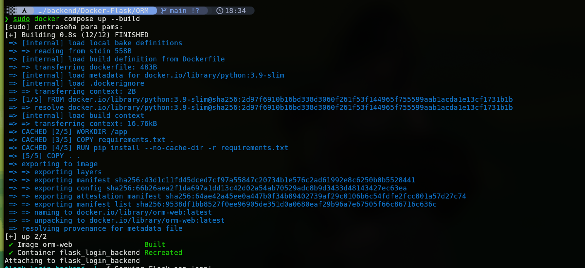
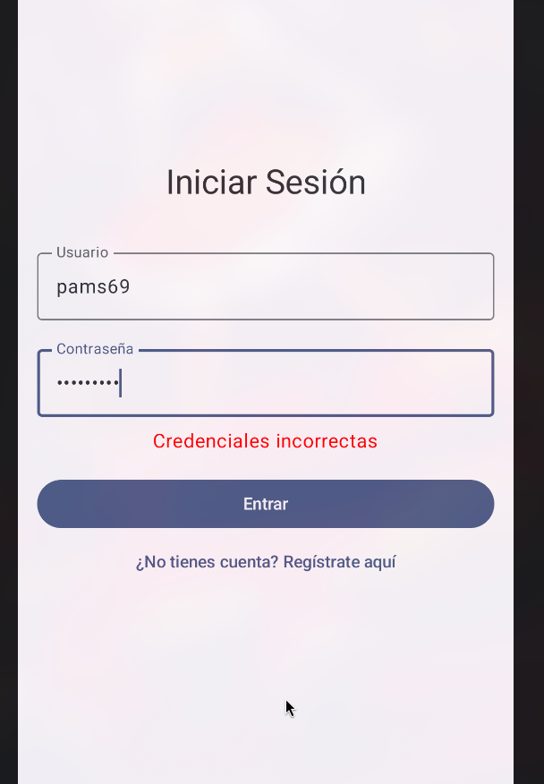
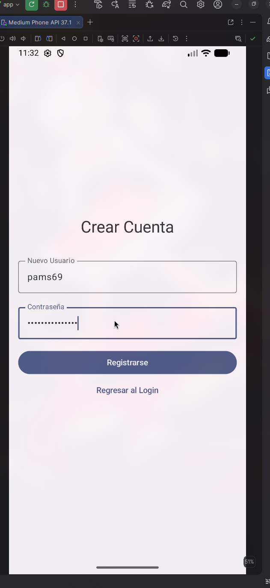
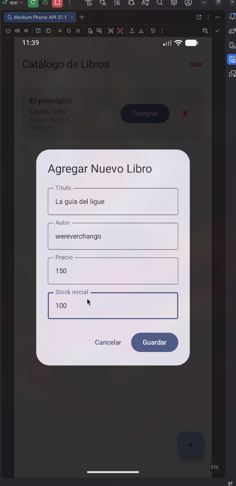
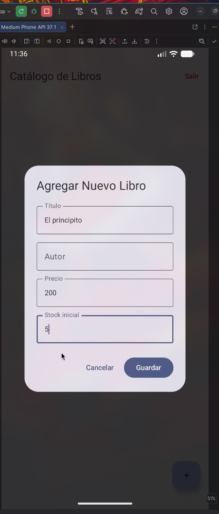
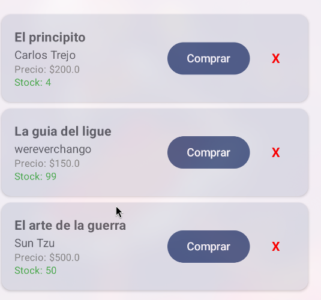
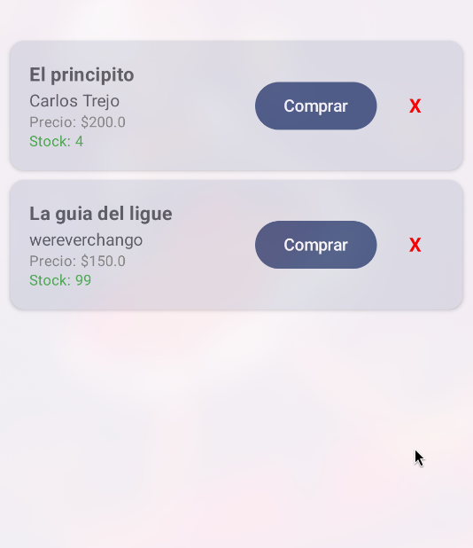

# Práctica 2: Aplicación móvil básica para operaciones CRUD con un servicio REST

**Alumno:** Hervey Gabriel Gutierrez Prats  
**Boleta:** 2022630373  
**Grupo:** 7CV4  
**Asignatura:** Desarrollo de aplicaciones móviles nativas  
**Fecha de entrega:** 18 de septiembre de 2026  

---

## Introducción
El presente proyecto consiste en el desarrollo de un sistema completo compuesto por un **Backend RESTful dockerizado** y una **Aplicación Móvil en Android** (LibreriaApp) que consume dichos servicios. 

La lógica del proyecto gira en torno a un catálogo virtual de libros. Los usuarios pueden registrarse, iniciar sesión de forma segura (las contraseñas se encriptan) y visualizar el catálogo. Además, se implementaron las cuatro operaciones fundamentales (CRUD): crear nuevos libros, visualizar el catálogo, simular una compra reduciendo el inventario (actualizar) y eliminar libros del sistema.

**Stack tecnológico elegido y justificación:**
*   **Backend (Flask + Python):** Se utilizó Flask por su ligereza y facilidad para levantar servicios REST en pocas líneas. Se acompañó de `Flask-SQLAlchemy` (ORM) y `Flask-Bcrypt` para el hasheo seguro de contraseñas.
*   **Base de datos (SQLite):** Elegida por su portabilidad. No requiere la instalación de un motor gestor externo y guarda los datos localmente en un archivo, lo cual es ideal para contenedores efímeros.
*   **Frontend Móvil (Jetpack Compose + Kotlin):** Se optó por el enfoque moderno y declarativo de Android. Compose permite crear interfaces interactivas y responsivas más rápido que el modelo clásico de vistas XML. Para las peticiones de red se utilizó **Retrofit** y **Gson**.

---

## Desarrollo

### Conceptos Clave
1.  **Docker:** Es una plataforma de virtualización a nivel de sistema operativo que permite empaquetar una aplicación y todas sus dependencias (librerías, binarios) en una unidad estandarizada para el desarrollo de software.
2.  **Imagen y Contenedor:** Una *imagen* es una plantilla inmutable de solo lectura con las instrucciones para crear el entorno (el código y sus dependencias). Un *contenedor* es la instancia en ejecución de esa imagen.
3.  **Dockerfile:** Archivo de texto que contiene una serie de instrucciones paso a paso que Docker lee para construir una imagen automatizada.
4.  **docker-compose.yml:** Archivo en formato YAML utilizado para definir y ejecutar aplicaciones Docker de múltiples contenedores. Permite configurar servicios, redes y volúmenes con un solo comando.
5.  **Backend o servicio REST:** Arquitectura de software que se apoya en el protocolo HTTP para comunicarse. Se expone a través de *endpoints* utilizando métodos estándar (GET, POST, PUT, DELETE) y devuelve datos estructurados, generalmente en JSON.
6.  **ORM y base de datos:** El ORM (Object-Relational Mapping) es una técnica de programación para convertir datos entre el sistema de tipos utilizado en un lenguaje orientado a objetos y una base de datos relacional, evitando escribir sentencias SQL manuales.

### Documentación de Endpoints (API)
La API cuenta con los siguientes endpoints principales:

#### Autenticación
*   **POST `/register`**: Registra un nuevo usuario en la base de datos con contraseña hasheada.
    *   *JSON de envío:* `{"username": "gabriel", "password": "123"}`
    *   *Respuesta:* `201 Created` - `{"message": "Usuario creado exitosamente"}`
*   **POST `/login`**: Inicia sesión validando credenciales.
    *   *JSON de envío:* `{"username": "gabriel", "password": "123"}`
    *   *Respuesta:* `200 OK` - `{"status": "success", "user_id": 1}`

#### Operaciones CRUD (Libros)
*   **POST `/books` (Crear):** Añade un nuevo libro al sistema.
    *   *JSON de envío:* `{"title": "Dune", "author": "Frank Herbert", "price": 300.0, "stock": 10}`
*   **GET `/books` (Leer):** Retorna la lista completa de libros disponibles.
*   **PUT `/books/<id>` (Actualizar):** Actualiza los datos de un libro (en la app se usa para restar stock y simular una compra).
    *   *JSON de envío:* `{"stock": 9}`
*   **DELETE `/books/<id>` (Borrar):** Elimina el libro de la base de datos.

### Instrucciones de Instalación y Ejecución

Para levantar el entorno completo se requiere tener `docker` y el plugin de `docker-compose` instalados:
1. Clonar este repositorio.
2. Navegar en terminal hacia la carpeta del backend: `cd backend/Docker-Flask/ORM`
3. Ejecutar el comando para levantar el servidor y la base de datos:
   ```bash
   sudo docker compose up --build
   ```
4. El backend estará escuchando peticiones en `http://localhost:5000`.
5. Abrir la carpeta `LibreriaApp` en Android Studio.
6. **Configuración de Red:** Para que la app se conecte correctamente al backend desde cualquier dispositivo o red, abre el archivo `local.properties` (ubicado en la raíz del proyecto Android) y agrega tu dirección IP local:
   ```properties
   BACKEND_BASE_URL=http://T.U.I.P:5000/
   ```
7. Sincronizar Gradle y ejecutar el emulador o tu dispositivo físico.

### Capturas del Funcionamiento

#### Levantamiento del entorno Docker (Terminal)


#### Manejo de Errores (Login Inválido)


#### Registro de Usuario Exitoso


#### Inicio de Sesión y Lectura del Catálogo (GET)


#### Creación de un recurso (POST)


#### Actualización simulando compra (PUT)


#### Eliminación de recurso (DELETE)


---

## Conclusiones
Durante el desarrollo de esta práctica logré integrar con éxito una aplicación móvil nativa con un backend contenedorizado. Uno de los mayores retos fue el enrutamiento de la red desde el emulador de Android (que virtualiza su propio adaptador) hacia el contenedor de Docker en un entorno Linux (Arch Linux). La direccion `10.0.2.2` no conseguía traspasar el ruteo interno de Docker asociado al `localhost` del host. 

La dificultad fue resuelta al asignar directamente la dirección IP física de la computadora en la red LAN dentro del cliente `Retrofit`, lo que permitió una comunicación fluida. Por otro lado, la adopción de Jetpack Compose facilitó notablemente la construcción y el manejo de estados de la UI (errores de validación, actualizaciones en tiempo real tras la respuesta del CRUD), confirmando sus ventajas frente al paradigma anterior de XML.

## Bibliografía
*   Android Developers. (2026). *Jetpack Compose Tutorial*. Recuperado de https://developer.android.com/jetpack/compose/tutorial
*   Docker Inc. (2026). *Docker Compose Overview*. Recuperado de https://docs.docker.com/compose/
*   Grinberg, M. (2018). *Flask Web Development: Developing Web Applications with Python*. O'Reilly Media.
